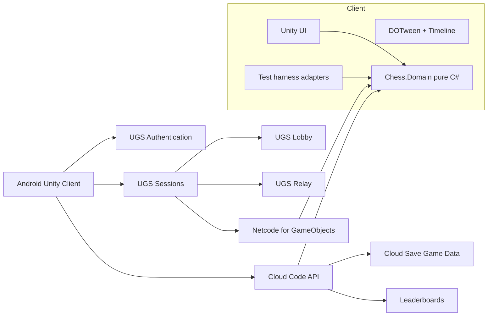

# ChessRiot
A crazy chess game for kids

## Executive summary

For your stated goals—**Android-first**, **rich colorful presentation**, **fast iteration**, **real-time and asynchronous online play**, and a **spec-first / test-flow workflow compatible with AI-assisted “vibe coding”**—the strongest MVP path is:

**Unity 6 LTS + a pure C# chess domain layer + Unity Gaming Services for online + DOTween/Timeline for polish + GitHub Actions/GameCI + Gherkin/JSON-Schema-backed test flows.** Unity now recommends Unity 6.3 LTS for new productions and supports it through **December 2027**; Unity 6.0 LTS is still supported through **October 2026**, so 6.0 remains the safer fallback if package compatibility is uneven. citeturn37search0turn37search1

The single biggest strategic choice is **not** Unity vs something else. It is whether you keep the **chess rules, move validation, clocks, serialization, and test oracles** in a **Unity-independent C# assembly**. If you do that, you preserve the option to migrate engines later at moderate cost. Unity explicitly supports managed plug-ins and precompiled assemblies, and Unity’s test guidance also strongly nudges teams toward custom assemblies rather than relying on `Assembly-Csharp.dll`. citeturn16search2turn16search1turn33view2

For online play, the best fit for a first shipped version is **UGS in two modes**. Use **Sessions + Relay + Netcode for GameObjects** for real-time matches, and use **Cloud Code + Cloud Save** for long-lived asynchronous matches. This recommendation is unusually strong because Unity already publishes a **server-authoritative asynchronous multiplayer chess sample** built on UGS **without requiring a dedicated game server**, and the new Multiplayer Services SDK’s **Sessions** flow can automatically handle lobby creation, relay allocation, and NGO connection setup. citeturn10view4turn20search6turn7search5turn7search9

The main alternative recommendations are clear. **Photon** is the best alternative if you want a battle-tested real-time stack with polished host-migration options and are comfortable pairing it with your own backend for async persistence. **Mirror** is the best “retain control / avoid CCU licensing” alternative, but the current Unity Relay sample for Mirror is deprecated and not maintained for later Unity versions, which increases integration risk for a fast-moving MVP. **PlayFab** is strongest when you want a larger live-service backend and Azure-scale growth path, but it is more infrastructure than you need for a first playable chess MVP. citeturn31view2turn26view2turn31view0turn32view0turn6search1turn30view1turn30view4

On process: “vibe coding” as coined by Andrej Karpathy describes natural-language-driven coding where the developer increasingly delegates code generation and even debugging to AI. That can work for scaffolding and vertical slices, but the practical correction is to make the repo **spec-anchored**, not code-anchored. GitHub’s Spec Kit and Microsoft’s current spec-driven-development guidance both argue for an artifact chain such as **constitution → spec → plan → tasks → implementation → validation**, explicitly because better specs improve AI coding output quality. citeturn14search0turn15view0turn15view1turn15view2

My bottom-line advice is therefore:

1. **Use Unity 6.3 LTS unless a chosen package forces 6.0 LTS.**
2. **Fork the architecture of Unity’s async chess sample, but do not couple your whole game to it.**
3. **Keep chess logic and persistence contracts outside Unity-specific code.**
4. **Author machine-readable specs from day one** using **Gherkin** and **JSON Schema**, then connect them to **Reqnroll/NUnit** for domain tests and **Unity Test Framework** for integration and E2E tests. citeturn37search0turn10view4turn25view0turn25view1turn25view2turn25view3turn33view0turn33view3

## Recommended architecture and stack

The recommended MVP stack is shown below.

| Layer | Recommended choice | Why it fits this project | Source |
|---|---|---|---|
| Engine | Unity 6.3 LTS, fallback to 6.0 LTS | LTS stability, long support window, large Android tooling ecosystem | citeturn37search0turn37search1 |
| Real-time multiplayer | UGS Sessions + Relay + Netcode for GameObjects | Sessions reduces setup complexity by orchestrating Lobby/Relay/NGO; NGO is Unity’s production-ready high-level networking layer | citeturn20search6turn20search5turn20search2 |
| Async multiplayer | Cloud Code + Cloud Save Game Data | Unity documents Cloud Save + Cloud Code as a server-authoritative persistent game-state path, and ships an async chess sample | citeturn7search5turn7search9turn10view4 |
| Auth | UGS Authentication with anonymous sign-in first | Free, simple, and already part of the UGS flow | citeturn29view3 |
| Chess rules | Pure C# adapter layer over Gera Chess for MVP | Gera Chess supports validation, SAN/FEN/PGN, and is used in Unity’s official async chess sample | citeturn10view0turn11view3 |
| Animation | DOTween + Timeline | DOTween is fast, C#-friendly, open-source/free; Timeline is built in for sequences and polish | citeturn36view0turn36view1turn36view2 |
| Content pipeline | Addressables + CCD | Remote content, downloadable themes/piece sets, live updates without app reinstalls | citeturn35view0turn35view1turn35view2 |
| CI/CD | GitHub Actions + GameCI | Mature Unity build/test automation, low friction, good fit for solo/indie iteration | citeturn34view0turn34view1turn23search2turn23search4 |
| Test/spec workflow | Gherkin + JSON Schema + Reqnroll/NUnit + Unity Test Framework | Machine-readable specs, executable scenarios, and Unity-native Edit/Play/Android test support | citeturn25view0turn25view1turn25view2turn25view3turn33view0turn33view3 |

A practical reference architecture looks like this:



The critical architectural rule is that **`Chess.Domain` owns the truth**. Unity is presentation plus transport; services are persistence plus coordination. That prevents Unity scene state from becoming your actual business logic and sharply reduces lock-in. Unity’s managed plug-in model and assembly references are the key enabling tools for this separation. citeturn16search2turn16search1turn33view2

A minimal folder layout for this architecture is:

```text
/specs
  constitution.md
  rules/
    game-state.schema.json
    move-command.schema.json
  features/
    async-match.feature
    realtime-match.feature
/docs
  product-spec.md
  technical-plan.md
  task-slices.md
/Domain
  Chess.Domain.csproj
  src/
  tests/
/UnityClient
  Assets/
  Packages/
  ProjectSettings/
/ServerContracts
  dto/
  contracts/
```

That structure maps closely to the spec-driven workflow now promoted by GitHub’s Spec Kit, whose project initialization creates agent prompts and templates for **spec**, **plan**, **tasks**, and a **constitution** file that captures non-negotiable engineering principles. citeturn15view1turn15view2

## Chess logic options

The library choice for chess is less about “which engine is strongest” and more about **which one lets you validate moves, serialize state, and test deterministically with low legal risk**.

| Option | What it gives you | License | Maturity signal | Estimated Unity integration effort | Best fit | Source |
|---|---|---|---|---|---|---|
| **Gera Chess Library** | Move generation/validation, SAN, FEN, PGN, event hooks for illegal moves/check/promotion/endgame | MIT | Used by Unity’s multiplayer chess sample | **Low–Medium** | Best MVP choice if you want fast shipping and alignment with Unity’s sample architecture | citeturn10view0turn11view3turn8search4 |
| **Rudzoft ChessLib** | Complete move generation, compact engine-oriented data types, perft tooling, KPK endgame data | MIT | Rich lower-level feature set; designed as a starting point for chess software | **Medium** | Best if you want a more engine-like internal model and deeper future extensibility | citeturn10view1turn9search7 |
| **Chess.NET / ChessDotNet** | Validation, variants, FEN | MIT | Explicitly marked “No longer maintained” | **Low** | Only if you need its supported variants and accept maintenance risk | citeturn10view2 |
| **Stockfish** | Very strong UCI engine for hints, analysis, or bot difficulty | GPLv3 | Industry-standard engine strength | **Medium–High** | Add later for analysis or coaching; avoid embedding in MVP unless GPL obligations are acceptable | citeturn10view3 |

The most pragmatic starting point is **Gera Chess** because it already covers the exact operations you need in a shipped chess app—validation, SAN/FEN/PGN round-trips, promotions, check/endgame signals—and Unity’s own async chess sample already uses it as the move validator. That dramatically reduces discovery risk during the MVP phase. citeturn10view0turn11view3

The most future-proof technical move is to define a tiny engine abstraction up front:

```csharp
public interface IChessRulesEngine
{
    string CurrentFen { get; }
    IReadOnlyList<string> LegalMovesFrom(string square);
    MoveResult TryApplyUci(string uciMove, string? promotion = null);
    GameStatus GetStatus();
    string ExportPgn();
}
```

Then put the concrete adapter behind it:

```csharp
public sealed class GeraChessAdapter : IChessRulesEngine
{
    // Wrap Gera Chess or any later engine here.
    // Keep Unity types out of this assembly.
}
```

That way, if later you decide Rudzoft is a better internal core, or you add Stockfish for hints, you touch the adapter layer rather than the whole game.

The most important anti-pattern to avoid is making Unity scene objects the canonical board state. Keep the canonical match state as a serializable domain object, for example:

```json
{
  "matchId": "m_123",
  "fen": "rnbqkbnr/pppppppp/8/8/8/8/PPPPPPPP/RNBQKBNR w KQkq - 0 1",
  "ply": 0,
  "whitePlayerId": "p_white",
  "blackPlayerId": "p_black",
  "clock": { "whiteMs": 300000, "blackMs": 300000, "incrementMs": 2000 },
  "status": "in_progress",
  "lastAppliedMoveUci": null
}
```

That model becomes the source of truth for **replay**, **async resume**, **desync repair**, **spectating**, and **test determinism**.

## Networking and backend comparison

A chess game is forgiving in ways that shooters are not. You do not need rollback netcode or twitch-grade latency hiding for the MVP. What you do need is: **authoritative move validation**, **reconnection**, **persistent match state**, and a **clean split between ephemeral real-time packets and durable async state**. That is why the stack choice should be driven more by **persistence and session lifecycle** than by raw transport sophistication. citeturn20search11turn7search5turn7search9

### Sessions and real-time networking

| Option | Real-time model | Async / turn-based story | Offline-sync story | Cost signal | Recommendation | Source |
|---|---|---|---|---|---|---|
| **UGS Sessions + Relay + NGO** | Host/client via Relay, NGO integrates with Unity objects; Sessions automates Lobby + Relay + NGO setup | Pair with Cloud Code + Cloud Save; Unity already ships async chess sample | Manual local queue/cache on client; durable state in Cloud Save | Very favorable for small games: Relay first 50 avg CCU included; Cloud Save/Cloud Code generous free tiers | **Best default** for this project | citeturn20search6turn20search12turn20search5turn29view0turn29view1turn29view2turn10view4 |
| **Mirror** | Open-source high-level networking, multiple transports including KCP | You own async persistence/backend | Manual | No CCU licensing from Mirror itself; infra is yours | Best if you want control and self-hosting, but slower MVP unless experienced | citeturn6search1turn6search0turn6search13 |
| **Mirror + Unity Relay sample** | Mirror over UTP/Relay | Same as Mirror | Manual | Reasonable infra path, but sample is deprecated | Not my first recommendation for a fresh MVP | citeturn32view0 |
| **Photon Fusion / Realtime** | Mature managed cloud multiplayer, good host/client tooling | Realtime supports persistent rooms and async via webhooks/web service | Manual client queue/cache; backend required for durable room state | Free 100 CCU, then $125/mo at 500 CCU | Strong alternative if real-time is the priority and you accept a second backend | citeturn31view0turn31view1turn31view2turn26view2 |
| **PlayFab Party + Lobby (+ MPS if needed)** | Low-latency data/voice, lobby grouping, optional dedicated Azure servers | Good broader backend story, but more moving parts | Manual | Free in development mode until you reach 10,000 players; lobby pricing usage-based when live | Best if you expect larger live-service scope or Azure-centric backend | citeturn30view0turn30view1turn30view4turn28view0turn26view1 |

Unity’s own distinction between **Lobby** and **Relay** is exactly the one you want to follow: Lobby is for grouping/configuration; Relay is for the actual peer-hosted game session. Sessions is attractive because it combines those building blocks while still keeping their capabilities. citeturn20search12turn20search6

Photon deserves explicit praise for asynchronous game support. Photon documents a turn-based mode where rooms are persisted and can be reloaded later, but that path explicitly requires **an external web service** for persistence. In other words, Photon can absolutely support chess well, but it is not a one-vendor answer for both realtime and long-lived async persistence. citeturn31view0turn31view1

### Backend and persistent state

| Backend path | Strengths | Weaknesses | Offline behavior | Source |
|---|---|---|---|---|
| **UGS Cloud Code + Cloud Save** | Native Unity fit; server-authoritative state model documented by Unity; sample async chess exists | Tighter Unity ecosystem coupling; not a general SQL backend | Persist to Cloud Save, queue locally yourself | citeturn7search5turn7search9turn7search6turn10view4 |
| **PlayFab Data / Entities** | Strong live-service backend, clear server/client/read-only/internal data access, identity and scale story | Heavier mental model and integration effort for a small MVP | No Firestore-like built-in offline cache semantics highlighted; usually implemented app-side | citeturn30view2turn28view0 |
| **Firebase Firestore** | Excellent mobile ergonomics, Unity SDK setup exists, offline persistence on Android, sync on reconnect | Real-time listener billing can surprise; not optimized as a game-session backend | **Best documented built-in offline behavior** for Android | citeturn27view1turn27view2turn27view0 |
| **Supabase** | Realtime broadcast/presence/Postgres changes, C# access exists, SQL backend flexibility | C# ecosystem is community-supported rather than one of Supabase’s official core libraries; more manual client conventions | Usually implemented with local caching you design yourself | citeturn22search1turn22search0turn27view3turn27view4 |

For **your exact use case**, my recommendation is not “UGS for everything forever.” It is:

- **UGS first for MVP shipping speed**
- Keep all match contracts portable
- Reassess after the first real beta

That gets you to a playable app fastest while preserving an escape hatch.

A minimal real-time move submission flow in NGO can stay simple:

```csharp
[ServerRpc(RequireOwnership = false)]
public void SubmitMoveServerRpc(string uciMove, ServerRpcParams rpc = default)
{
    var sender = rpc.Receive.SenderClientId;
    if (!match.CanPlayerMove(sender, uciMove)) return;

    var result = match.ApplyMove(uciMove);
    if (!result.Accepted) return;

    fen.Value = match.CurrentFen;         // NetworkVariable<string>
    lastMove.Value = uciMove;
    OnMoveAppliedClientRpc(uciMove, fen.Value);
}
```

And the corresponding async path in Cloud Code should look conceptually like:

```csharp
public async Task<ApplyMoveResponse> ApplyMove(ApplyMoveRequest req)
{
    var state = await _cloudSave.LoadMatch(req.MatchId);
    var result = _rules.TryApplyUci(req.UciMove, req.Promotion);

    if (!result.Accepted) return new(false, state.Fen, result.Reason);

    state.Fen = _rules.CurrentFen;
    state.LastAppliedMoveUci = req.UciMove;
    state.Ply += 1;

    await _cloudSave.SaveMatch(req.MatchId, state);
    return new(true, state.Fen, null);
}
```

That split—**NGO for live transport, Cloud Code for durable authoritative turns**—is the cleanest way to support both play modes without overengineering a small chess game.

## Iteration tooling and asset pipeline

Fast iteration in Unity is mostly a game of reducing editor startup/recompile friction, isolating assemblies, and making content swappable without full app rebuilds.

Unity’s **Configurable Enter Play Mode** lets you disable **domain reload** and/or **scene reload** to reduce the wait when entering Play Mode. Unity’s own documentation says these reloads take time and that disabling them is meant to improve iteration speed; Unity’s blog reported **up to 50–90% waiting-time savings** in their testing, with the very important caveat that you now own reset logic for static fields and static event handlers. citeturn35view3turn35view4turn35view5turn35view6

That makes the following setup ideal for your project:

| Tooling area | Recommendation | Why | Source |
|---|---|---|---|
| Enter Play Mode | Disable domain reload for day-to-day feature work when safe; add explicit reset hooks | Fastest native iteration improvement in Unity | citeturn35view3turn35view4turn35view5 |
| Hot reload | Optional third-party **Hot Reload for Unity** | Patches modified functions and supports on-device player debugging; currently around **$39.99/seat** on the pricing page | citeturn18search0turn36view3turn26view3 |
| Animation micro-interactions | DOTween | C#-friendly, low-friction, fast, free/open-source standard version | citeturn36view0turn36view1 |
| Sequenced reveals/victory moments | Timeline | Built-in package for cinematics/gameplay sequences/effects | citeturn36view2 |
| Downloadable themes/piece packs | Addressables + CCD | Remote content and live updates without reinstall | citeturn35view0turn35view1turn35view2 |
| CI/CD | GitHub Actions + GameCI | Straightforward Unity test/build automation with caching and coverage artifact support | citeturn34view0turn34view1turn23search2turn23search4 |

A good asset strategy for this chess app is to treat **themes as remote content**:

- board skins
- piece materials / meshes / sprites
- move VFX
- sound packs
- seasonal UI palettes

Addressables exists specifically for remote distribution via CCD or any CDN/host, and Unity’s CCD walkthrough shows the intended workflow of generating AssetBundles and serving them remotely. That is perfect for a family-friendly chess app where the “toy box” experience matters almost as much as the rules. citeturn35view0turn35view1

For animations, use **DOTween for almost everything tactile**: piece lift, hover, legal-target pulsing, move arcs, capture bursts, check/checkmate emphasis, UI counters, turn indicators. Reserve **Timeline** for ceremony: app startup, daily challenge reveal, victory screen, seasonal events, theme transitions. DOTween gives speed of authoring; Timeline gives directed polish. citeturn36view0turn36view2

A minimal content-pipeline rule that pays off quickly is:

- **Game logic assets** in the main app
- **Decorative assets** as Addressables
- **Seasonal/experimental content** in CCD buckets

That minimizes rebuild frequency and lets you iterate on visual delight without touching the core APK every time.

## Spec-first testing workflow

This is the section that matters most if you actually want to “vibe code” the project without letting it collapse into prompt soup.

Karpathy’s original “vibe coding” framing was essentially: let AI write most of the code and increasingly ignore implementation detail. That is exactly why the modern correction is **spec-driven development**. GitHub’s Spec Kit explicitly positions itself as a way to focus on **product scenarios and predictable outcomes instead of vibe coding every piece from scratch**, and Microsoft’s follow-on guidance makes the lifecycle explicit: **constitution → specify → clarify → plan → tasks → implement → validate**. citeturn14search0turn15view0turn15view1turn15view2

### Minimal spec-first artifact set

For this project, the smallest useful artifact set is:

| Artifact | Purpose | Format | Why machine-readable matters | Source |
|---|---|---|---|---|
| `constitution.md` | Non-negotiables: Android-first, test-first enough, domain isolation, no GPL contamination, async + realtime parity | Markdown | Anchors AI behavior across sessions | citeturn15view1turn15view2 |
| `product-spec.md` | Feature intent and acceptance criteria | Markdown | Human-readable truth source | citeturn15view1 |
| `game-state.schema.json` | Canonical match state contract | JSON Schema 2020-12 | CI-validatable, tool-friendly, contract tests | citeturn25view3 |
| `.feature` files | User-visible behavior and acceptance tests | Gherkin | Executable specifications; parser emits ASTs/Pickles as NDJSON | citeturn25view0turn25view1 |
| domain tests | Rules correctness | NUnit / Reqnroll | Fast, deterministic, engine-agnostic | citeturn25view2turn33view3 |
| Unity integration tests | UI, scene, networking flows | Unity Test Framework | Edit mode, Play mode, target platforms including Android | citeturn33view0turn33view3 |

### Recommended execution model

Use **three concentric test rings**.

The inner ring is **pure domain tests**. These run outside Unity if possible and validate rules, clocks, serialization, repetition, promotion, and idempotency. This is where Reqnroll can shine, because it turns Gherkin scenarios into NUnit/xUnit/MSTest/TUnit executable tests on .NET. citeturn25view2

The middle ring is **Unity EditMode and PlayMode tests**. Unity’s Test Framework supports both modes and target platforms such as Android. Unity also recommends using `[Test]` unless you specifically need frame progression or waiting, which keeps these tests fast. citeturn33view0turn33view2turn33view3

The outer ring is **pipeline validation and coverage**. Unity’s Code Coverage package exports reports from automated tests, and GameCI can upload both test artifacts and coverage results in CI. citeturn33view1turn34view1

### Authoring machine-readable specs

Use **Gherkin for behavior** and **JSON Schema for contracts**.

Cucumber’s Gherkin reference defines the executable-specification syntax, and the Gherkin CLI can compile `.feature` files into **ASTs and Pickles** emitted as newline-delimited JSON. That is exactly the bridge you want between narrative requirements and machine-checkable test generation. citeturn25view1turn25view0

Use JSON Schema 2020-12 for the durable data contracts. JSON Schema’s current specification is 2020-12, and its meta-schemas let you validate your schemas themselves in CI. citeturn25view3

Example contract:

```json
{
  "$schema": "https://json-schema.org/draft/2020-12/schema",
  "$id": "move-command.schema.json",
  "type": "object",
  "required": ["matchId", "playerId", "uciMove", "expectedFen"],
  "properties": {
    "matchId": { "type": "string", "minLength": 1 },
    "playerId": { "type": "string", "minLength": 1 },
    "uciMove": {
      "type": "string",
      "pattern": "^[a-h][1-8][a-h][1-8][qrbn]?$"
    },
    "promotion": { "type": ["string", "null"], "enum": ["q", "r", "b", "n", null] },
    "expectedFen": { "type": "string", "minLength": 1 }
  },
  "additionalProperties": false
}
```

Example Gherkin feature:

```gherkin
Feature: Resume an asynchronous chess match

  Scenario: Player resumes after being offline
    Given an existing match "m_123" with fen "rnbqkbnr/pppppppp/8/8/8/8/PPPPPPPP/RNBQKBNR w KQkq - 0 1"
    And it is White's turn
    When White submits move "e2e4"
    Then the move is accepted
    And the match fen becomes "rnbqkbnr/pppppppp/8/8/4P3/8/PPPP1PPP/RNBQKBNR b KQkq - 0 1"
    And Black can load the match later and see the updated fen
```

### Concrete test ideas and flows

| Area | Test flow | Why it matters |
|---|---|---|
| Rules engine | Starting position has 20 legal moves; illegal moves rejected; castling, en passant, promotion, checkmate, stalemate verified | Prevents silent rules regressions |
| Serialization | FEN import/export roundtrip; PGN export after a known opening line; SAN formatting | Async resume and replay depend on this |
| Async persistence | Same move submitted twice is idempotent; stale `expectedFen` causes conflict response; reconnect after offline resumes latest state | Prevents race conditions and ghost turns |
| Realtime sync | Two clients start from same FEN, submit move, both converge; reconnecting client gets latest authoritative state | Prevents desync |
| UI | Drag legal piece shows legal targets; illegal drop snaps back; promotion modal appears only when needed | Core playability |
| Animation | Capture animation never blocks authoritative state update; board remains tappable after animation sequence | Prevents “pretty but broken” UX |
| Android-specific | Resume from background during live match; airplane mode during async submit; low-memory resume | Mobile reality |
| Safety/cheat resistance | Client attempts illegal move or wrong-turn move; server/cloud authority rejects | Must never trust client board state |

The most important design principle here is: **every feature starts life as either a dataset, a schema, or a scenario before it starts life as code**. That makes AI assistance materially safer and more reusable.

## Migration costs, roadmap, risks, and rough cost ranges

### Migration cost if you switch engines later

Here is the blunt answer you asked for about Unity lock-in.

If you keep the architecture above, **switching networking providers inside Unity is moderate pain**, while **switching away from Unity entirely is meaningful but survivable**. The real lock-in points are not your chess rules or DTOs. They are Unity scene/UI code, animation timelines, and multiplayer glue based on NGO, Mirror, or Photon concepts. NGO is explicitly a networking stack for **GameObject & MonoBehaviour workflows**, which is productive now but coupling later. citeturn20search8turn20search11

| Migration scenario | Rough effort if domain is isolated | What largely survives | What mostly rewrites |
|---|---|---|---|
| UGS NGO → Photon inside Unity | **2–5 weeks** | Chess domain, tests, art, most UI prefabs | Session flow, RPCs, sync state, lobby/relay integration |
| UGS NGO → Mirror inside Unity | **2–4 weeks** | Chess domain, tests, art | Network managers, object sync, connection flow |
| Unity → another engine, same backend contracts | **6–12 weeks** | Chess domain DLL logic if portable to plain C#, schemas, Gherkin, backend contracts, art assets | UI, animation graphs, input, scene setup, networking client code |
| Unity + UGS → different engine + different backend | **10–20 weeks** | Specs, schemas, game rules, art | Nearly all client integration and service glue |

Those are experience-based estimates, not vendor promises. They depend heavily on one discipline: **never let chess rules or save-schema logic drift into Unity behaviours**.

### Key risks and mitigations

| Risk | Why it is real | Mitigation |
|---|---|---|
| Rules engine compatibility surprises | Some chess libraries are packaged for modern .NET profiles; Unity compatibility can vary by import method | Vendor source or compile a compatible managed plug-in early; prove it on day one |
| Realtime and async divergence | Two online modes can fork business logic | Use one canonical `Chess.Domain` and one canonical match schema |
| Hidden editor-state bugs from disabled domain reload | Unity warns you must explicitly reset statics and handlers when domain reload is disabled | Add reset hooks, run full-reload CI and normal-reload local sanity passes | 
| Overreliance on hot reload/AI scaffolding | Fast iteration can hide architectural drift | Require updated spec + scenario + adapter tests for every feature slice |
| Licensing contamination from Stockfish | GPLv3 is powerful but restrictive for embedded distribution | Keep Stockfish out of MVP, or isolate it in a compliant distribution model |
| Cost creep from realtime listeners / traffic | Firestore listener billing and relay bandwidth can surprise | Instrument usage from day one, cap lobby polling, serialize compactly |
| Mirror sample staleness | Unity’s Mirror Relay sample is deprecated and tested on old Unity | Avoid as primary path for a new fast-moving MVP | citeturn35view4turn32view0turn10view3turn27view0 |

### Prioritized roadmap

A realistic roadmap for a **solo developer using AI heavily but keeping specs/tests first-class** looks like this:

```mermaid
gantt
    title Suggested MVP roadmap
    dateFormat  YYYY-MM-DD
    axisFormat  %b %d

    section Spec and foundation
    Constitution, schemas, feature files, domain skeleton :a1, 2026-07-02, 5d
    Engine + package proof, Android baseline build       :a2, after a1, 3d

    section Core gameplay
    Local chess board, input, rules adapter, clocks      :b1, after a2, 7d
    Visual juice: DOTween interactions, theme system     :b2, after b1, 5d

    section Online
    Async path with Cloud Code + Cloud Save              :c1, after b2, 7d
    Realtime path with Sessions + Relay + NGO            :c2, after c1, 7d

    section Hardening
    E2E tests, reconnects, offline queue, coverage       :d1, after c2, 6d
    Android polish, telemetry, crash diagnostics         :d2, after d1, 4d
```

### Effort estimate

For an MVP that includes:
- one polished board theme,
- rich piece movement and feedback,
- anonymous sign-in,
- creating/joining matches,
- real-time match play,
- async match play,
- basic reconnect/resume,
- spec artifacts and CI tests,

I would estimate:

| Scope level | Solo full-time estimate | Comment |
|---|---|---|
| Bare vertical slice | **2–4 weeks** | Local board + one online mode + minimal polish |
| Credible MVP | **6–10 weeks** | Both online modes, Android hardening, proper tests |
| Polished family-friendly launch candidate | **10–16 weeks** | Content pipeline, multiple themes, retention loops, analytics, robustness |

“Heavily AI-assisted” can compress the first half of that schedule, especially repo scaffolding, DTOs, tests, and boilerplate. It usually does **not** compress final polish, cross-device bug-fixing, or networking edge cases by the same factor.

### Rough cost ranges

The current vendor pricing pages support a fairly favorable indie cost profile.

| Cost area | Likely MVP range | Why |
|---|---|---|
| Unity engine license | **$0** if you qualify for Unity Personal under the current **<$200K revenue/funding** eligibility | citeturn26view4 |
| UGS backend in prototype / small beta | **$0–$50/month** | Authentication is free; Cloud Save includes 5 GiB plus 1M reads and 1M writes/month; Cloud Code includes 1M invocations and 20 compute hours/month; Relay includes the first 50 average monthly CCU | citeturn29view0turn29view1turn29view2turn29view3 |
| CCD remote content | **$0 initially**, then bandwidth after **50 GB/month** | Good for downloadable themes | citeturn29view3 |
| Optional Hot Reload | **about $40/seat one-time** at current pricing page | Pure iteration luxury, not required | citeturn26view3 |
| Photon alternative for realtime | **$0** at 100 CCU free, **$125/month** at 500 CCU | Good if you pivot to Photon-first multiplayer | citeturn26view2 |
| PlayFab alternative | **Free in development mode** until you reach **10,000 players**, then usage-based | Stronger live-service path, more backend surface area | citeturn28view0turn26view1 |
| Firebase alternative | **Highly usage-shaped**; small apps can stay cheap, but real-time listener billing can climb | Reads/listens matter more than just stored size | citeturn27view0turn27view1 |
| GitHub Actions / CI | **$0–low tens/month** for a private indie repo, less if usage stays within included quota or you use public repos/self-hosted efficiently | Public repos and self-hosted behavior differ by plan and billing mode | citeturn23search2turn23search4turn23search12 |

If I compress all of this into one decision sentence, it is this:

**Build the MVP in Unity now, but build the chess game itself outside Unity.** That gives you the fastest path to a colorful, online, Android-first chess app **and** the cheapest future option value if you later decide Unity, NGO, or UGS should be replaced.
