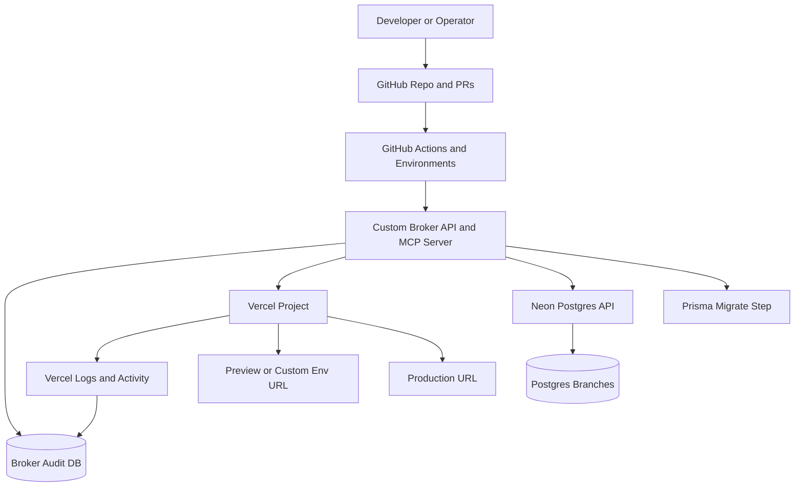
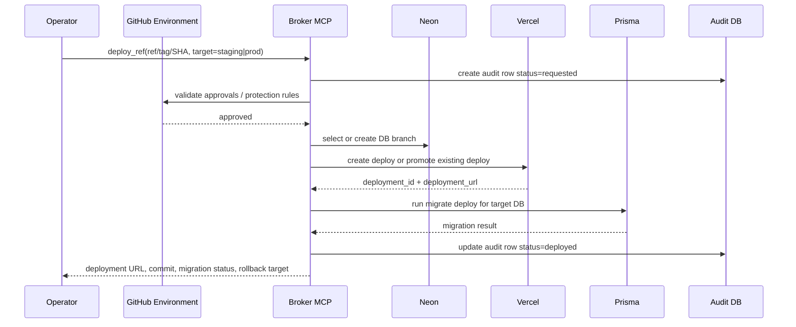

# Deployment Broker Design for a Chess Player Website

## Executive summary

The best overall fit is a **Vercel-first architecture with a thin custom deployment broker that exposes its own MCP tools**, while using **GitHub as the source of truth**, **Neon Postgres for branching-friendly databases**, and **Prisma Migrate for controlled forward migrations**. This is the best balance of your stated preferences: minimal setup, Vercel affinity, support for Dev/Staging/Production plus many feature environments, audit logging, manual rollback, deploy-by-version, and an upgrade path toward GDPR and child-privacy readiness. Vercel already supports preview, production, and custom environments; GitHub Actions environments add manual approvals and protection rules; Neon’s branching model is well suited to feature environments and preview databases; Prisma’s production guidance supports a simple non-atomic migration path. citeturn21search0turn21search2turn11search1turn13search1turn0search3turn0search39

A crucial finding is that **Vercel’s official MCP server is currently read-only at launch**, focused on docs, logs, and project metadata, whereas **GitHub, Netlify, Neon, and AWS all publish stronger MCP stories for operational control**. If the goal is “I want everything to be managed by you,” the cleanest way to keep a Vercel stack **and** make it agent-manageable is not to rely on Vercel MCP alone, but to place your own broker in front of Vercel and expose **broker MCP tools** such as `deploy_ref`, `rollback_deployment`, `promote_preview`, `create_feature_env`, and `run_migration`. Vercel still hosts the site; the broker becomes the agent-safe control plane. citeturn28search0turn18view1turn17view9turn9search2turn17view11

If your absolute top priority becomes **official MCP-driven infrastructure control with minimum custom glue**, then **Netlify** becomes the strongest alternative, because its official MCP server is explicitly designed to let agents create projects, deploy apps, manage settings, and work with its platform primitives. If your top priority becomes **compliance runway and maximum control**, then an **AWS-first control plane** is the strongest long-term option, but it is materially heavier than what you need for an MVP. citeturn17view9turn10search2turn17view11turn16search2turn16search15

For privacy, the important architectural conclusion is that because the service is **likely to be accessed by children**, you should treat privacy as a first-class deployment concern from day one: protected preview URLs, strict audit trails, region-aware data hosting, seed/synthetic data in feature environments, and a migration path toward age assurance / parental-consent workflows later. GDPR gives children specific protection, GDPR Article 8 governs child consent in information society services, the UK Children’s Code applies to services likely to be accessed by children, and COPPA applies in the U.S. to child-directed services or operators with actual knowledge they are collecting personal information from children under 13. citeturn7search0turn7search6turn6search22turn6search2turn6search1turn6search9

## Scope and assumptions

This report assumes a **new web application** with **low legacy-data constraints**, a likely **TypeScript/Next.js-style frontend**, a preference for **managed hosting over self-managed infrastructure**, a tolerance for **non-atomic database changes**, and a desire for **manual human control over production promotions and rollbacks**. It also assumes GitHub is acceptable as the development source of truth, because GitHub Actions environments and deployment protection rules are the leanest official way to insert approvals and broker gates into the deployment path. citeturn11search1turn11search0turn25search17

The broker needs to support four kinds of deployment targets:

| Target class | How it should behave |
|---|---|
| Dev | fast, low-friction, can auto-deploy from a main development branch |
| Staging | stable pre-production, can run migrations automatically after checks |
| Production | manual approval, explicit target version, rollback to known prior deployment |
| Feature environments | unlimited-ish branch-based previews, short-lived, safe to destroy |

On Vercel, this maps naturally onto **development, preview, production, and custom environments**, with custom environments available for long-lived targets like `staging`, `qa`, or `uat`, and preview deployments handling feature branches and pull requests. GitHub Environments can then enforce branch restrictions, required reviewers, and custom deployment protection rules on top of that. citeturn21search0turn21search2turn11search1turn11search0turn11search13

For child/privacy readiness, the report assumes you will eventually need to support at least some combination of **data minimization**, **retention policies**, **export/delete workflows**, **age-aware product decisions**, and **country-/region-aware data handling**. None of the hosting providers make the application compliant by themselves; they provide infrastructure controls, while the application still carries the controller obligations and product-design obligations. AWS states this explicitly under the shared responsibility model; the same operational reality applies across managed platforms. citeturn16search15turn16search2turn6search7turn23view5turn16search1

Two pragmatic assumptions shape the recommended design. First, **application rollbacks and database rollbacks should be treated separately**. Platform rollback capabilities are usually fast for application artifacts, but they do not “time-travel” your data automatically. Netlify says rolling back a deploy does not restore the database; Fly says rollback is of the VM image, not the database; Prisma recommends forward-oriented production workflows and expand/contract patterns for risky schema changes. Second, because you have little existing data, **feature environments should use synthetic or sanitized data initially**, not live child data. citeturn26search2turn27view2turn0search3turn0search39turn7search4turn6search2

## Candidate architectures

The fit score below is tailored to your profile: **Vercel-friendly**, **minimal setup**, **manual control**, **upgradeable**, and **agent-manageable**. A higher score is better for you.

| Architecture | Core stack | Strengths | Weaknesses | Owner involvement | Agent-manageability | Fit score |
|---|---|---|---|---|---|---|
| **Thin GitHub-governed Vercel broker** | GitHub repo + GitHub Actions Environments + Vercel + Neon + Prisma. GitHub approvals gate deployment; Vercel handles preview/custom/prod environments; Neon handles DB branches. citeturn11search1turn21search0turn21search10turn13search1turn0search3 | Lowest setup burden; very strong Vercel fit; preview and feature environments are straightforward; manual production approvals are simple; rollback and promote flows are native on Vercel. citeturn20search0turn20search1turn20search15turn21search0 | Vercel MCP is still read-only, so agent control is indirect; audit depth is limited unless you add your own broker ledger; production approval logic mostly lives in GitHub, not a domain-specific broker. citeturn28search0turn19search0turn28search17 | Low | Medium | **8.6 / 10** |
| **Custom Broker MCP on Vercel** | Same as above, plus a small broker service and broker database. The broker exposes MCP tools and internally calls GitHub, Vercel, Neon, and Prisma. | Best balance of your goals: still lean and Vercel-native, but gives you a real control plane with explicit audit rows, target-version deploys, feature environment lifecycle, and rollback tools that I can use through MCP. Supported by GitHub deployment protection rules and provider APIs. citeturn11search17turn11search1turn8search11turn13search0 | Slightly more setup than the thinnest option; you have to maintain one small internal service; hardest design choice is deciding which mutation powers live in broker MCP vs GitHub workflows. | Medium at setup, Low ongoing | High | **9.4 / 10** |
| **Netlify MCP-native broker** | GitHub + Netlify + Netlify MCP + Netlify deploy previews/branch deploys + Netlify DB or Neon. | Strongest official “AI manages the platform” story among the low-ops options; deploy previews and immutable deploy permalinks are excellent; rollback to an earlier deploy is explicit; env-variable changes are captured in the team audit log. citeturn17view9turn23view0turn26search1turn23view2 | Less aligned with your Vercel preference; if you want a future-heavy Next.js/Vercel ecosystem posture, this is a strategic fork; database rollback is still separate from app rollback. citeturn26search2turn23view5 | Low | Very high | **8.3 / 10** |
| **AWS control-plane stack** | GitHub + AWS ECS/CodeDeploy or Amplify + RDS/Aurora + CloudTrail + IAM/OIDC. | Strongest compliance runway, strongest IAM model, strongest auditability, strongest future policy control. AWS MCP can call AWS APIs with IAM-based governance; blue/green deploys make rollback and validation strong. citeturn17view11turn22view5turn22view4turn16search2turn16search15 | Highest setup and cognitive load; feature environments are not as turnkey as Vercel/Netlify; overkill for your MVP unless compliance becomes the dominant concern immediately. | High | High | **7.1 / 10** |

The recommendation is therefore **Option two: Custom Broker MCP on Vercel**. It preserves the advantages that made you lean toward Vercel in the first place, while solving Vercel’s current MCP limitation by introducing a broker that I can operate safely on your behalf. The broker also becomes the right place to add policy over time: release freezes, schema-risk labels, data-retention rules for feature environments, child-data masking rules, and “production deploys must be approved by human” constraints. citeturn28search0turn21search0turn11search1turn13search1

If you decide that official MCP control matters more than platform preference, the fallback recommendation is **Netlify-first**. If you decide that compliance and org-wide security governance matter more than speed, the fallback recommendation is **AWS-first**. citeturn17view9turn17view11turn16search2

## Recommended architecture

The recommended design is a **lean deployment broker control plane** with a deliberately small scope:

1. **GitHub remains the source of truth** for code, pull requests, version refs, and release tags. GitHub Environments enforce branch policies, required reviewers, and optional custom protection rules that can call the broker before production-like deploys continue. citeturn11search1turn11search0turn25search9  
2. **Vercel remains the application runtime and edge platform** for Dev/Preview/Production plus any long-lived custom environments such as Staging or QA. Vercel Preview Deployments cover most feature branches; custom environments cover named, stable environments. citeturn21search0turn21search10turn21search2  
3. **Neon Postgres remains the relational control/data store**, with one production branch, one staging branch, and short-lived feature branches when a feature environment needs database isolation. Neon’s Vercel integration is specifically designed for preview-branch workflows. citeturn0search2turn0search6turn13search1  
4. **Prisma Migrate remains the migration mechanism**, but production uses `migrate deploy` and an expand/contract discipline for destructive changes instead of trying to promise atomic schema rollback. citeturn0search3turn0search7turn0search39  
5. **The broker owns the operational truth**: who asked for deployment, what version was deployed, which environment it targeted, who approved it, which Vercel deployment ID/URL was produced, which DB branch and migration batch were used, and what rollback target is safe. This is what lets an agent manage the system coherently.

A single deployment request should carry at least these broker fields: `git_sha`, `git_ref`, `release_tag_optional`, `target_env`, `requested_by`, `approved_by`, `migration_plan`, `vercel_deployment_id`, `vercel_url`, `db_branch`, `status`, `rollback_target`, and `retention_expiry_for_feature_env`. That gives you the audit trail you asked for, and it keeps rollback deterministic rather than memory-based. Vercel already gives each deployment a unique URL and supports promote/rollback behaviors; the broker simply makes those operationally explicit and searchable. citeturn20search22turn20search15turn20search12turn19search0

A production deployment flow should look like this:

For **manual rollback**, the broker should distinguish two cases.  
An **application rollback** is fast: point production back to a specific previous Vercel deployment or promote a known good deployment to production. Vercel supports instant rollback and promotion of existing deployments, which is exactly what you want for “roll back the previous deployment” and “deploy a specific previous version.” citeturn20search0turn20search1turn20search9turn20search15

A **database rollback** should usually not be automatic in production. That is not a Vercel limitation; it is the sane operating model on most platforms. Netlify explicitly says deploy rollback does not restore the database, and Fly explicitly says rollback is not data time travel. Prisma’s production guidance is consistent with that reality: apply migrations predictably, and use expand/contract for risky changes. For your app, where non-atomic is acceptable and data volume starts low, the right rule is: **automate forward migrations, keep production schema reversal manual, and avoid destructive one-step schema changes in prod**. citeturn26search2turn27view2turn0search3turn0search39

For feature environments, the best pattern is:

- **Use Vercel Preview Deployments by default** for branch/PR previews. citeturn21search10turn20search18  
- **Create Neon branches only when the feature needs DB isolation**; otherwise point read-only previews at staging-like data or synthetic seed data. Neon’s branching model exists exactly for isolated copies and per-preview workflows. citeturn0search2turn0search10turn13search1  
- **Protect preview URLs** using Vercel Authentication or equivalent preview restrictions, especially once child-related data enters the system. citeturn21search4turn0search32  
- **Auto-expire feature environments** after merge/close or after inactivity. Both Vercel and Netlify document deployment retention concepts; the broker should keep its own feature-environment retention policy regardless of platform retention. citeturn20search2turn23view1

The migration strategy should stay intentionally simple:

| Environment | Migration rule | Why |
|---|---|---|
| Dev | `prisma migrate dev` or disposable resets | Fast iteration is more important than strict lineage. citeturn0search19turn0search35 |
| Feature envs | `migrate deploy`, ephemeral branch, destroy on merge | Matches Neon preview-branch model; safe because the environment is disposable. citeturn0search2turn13search1 |
| Staging | `migrate deploy` automatically after deploy | Mirrors production behavior. citeturn0search11turn0search7 |
| Production | `migrate deploy` only after approval, with forward-only / expand-contract for breaking changes | Lowest complexity that is still reasonably safe. citeturn0search3turn0search39 |

For privacy readiness, the broker should also enforce three non-negotiable operational rules from the beginning. First, **preview environments must not expose child data publicly**. Second, **audit logs must include who approved production deployments and when**. Third, **feature-environment data retention must be short and explicit**. These are not full legal compliance, but they are the right infrastructure habits for a product likely to be used by children. citeturn6search2turn6search22turn7search0turn6search1

## Vendors, permissions, and MCP responsibilities

For the recommended architecture, the required and recommended vendors are as follows.

| Vendor | Role in system | What to request | Why this matters |
|---|---|---|---|
| **GitHub** | Source control, PRs, workflow triggers, approvals, deployment metadata | Install a GitHub App or use tightly scoped automation. Minimum recommended repo permissions: **Metadata read**, **Contents read/write**, **Pull requests read/write**, **Deployments read/write**, **Checks read/write**, and **Actions read/write where workflow dispatch or workflow management is needed**. GitHub custom deployment protection rules additionally require a GitHub App with **Deployments read/write** plus the protection-rule event subscription. citeturn25search12turn25search4turn25search9turn25search0 | Lets the broker create/update deployment records, comment on PRs, run workflows, and enforce human approvals. |
| **Vercel** | Hosting runtime for dev/preview/prod/custom envs | A **dedicated automation user or team-scoped access token**, with that identity assigned as **Project Admin** on the specific project; access to deployments, environment variables, logs, domains, and webhooks through Vercel’s API/CLI. Vercel access tokens are team-scoped, so isolation should come from team/project structure and role assignment. citeturn8search11turn21search3turn8search1turn8search5turn8search14turn12search7 | Lets the broker create/promote/rollback deployments, manage env vars per environment, and fetch logs. |
| **Neon** | Postgres plus branch-based environments | Prefer a **project-scoped API key** for one production project; do **not** use an organization API key unless you truly need cross-project administration, because org keys provide admin-level access to all org resources. citeturn13search15turn13search4turn13search7 | Lets the broker create staging/preview branches, manage roles/databases, and map each feature env to isolated DB state. |
| **Prisma** | Schema migration toolchain | No external account permission beyond repo/package access; but approve the production rule that only the broker or vetted CI can run `migrate deploy`. citeturn0search3turn0search7 | Keeps DB changes predictable without introducing a heavyweight migration control plane. |
| **DNS provider** | Domain routing | Domain-level access only if you want the broker to create/update environment-specific domains; otherwise manage DNS manually and keep it outside the broker. Vercel can manage project domains through API. citeturn8search14turn8search25 | Needed only if you want automated `staging.example.com`, `qa.example.com`, or feature subdomains. |
| **Optional log sink** | Long-term searchable logs and compliance evidence | Later, add a log drain destination and give the broker only endpoint credentials, not full admin to the sink. Vercel supports log drains for logs and traces. citeturn12search16turn12search21 | Native logs are enough for MVP, but not ideal forever for operational evidence and alerting. |

The MCP posture matters a lot for your “managed by you” goal:

| Platform | Official MCP capability | Operational implication |
|---|---|---|
| **GitHub** | Official MCP server maintained by GitHub; can read repos, manage issues/PRs, analyze code, and automate workflows. citeturn18view1turn18view0 | Very strong for code- and release-oriented control. |
| **Vercel** | Official MCP server exists, but the launch posture is **read-only** and centered on docs, logs, teams, and project metadata; Vercel’s own roadmap says future updates will expand configuration mutation. citeturn28search0turn28search5 | Great for observability and context, not yet ideal as the only write-path control plane. |
| **Neon** | Official MCP server / AI-agent API allows AI assistants to interact with Neon projects; Neon documents use cases including creating databases, running SQL queries, and managing migrations. citeturn9search2turn9search18 | Strong for DB lifecycle if you want agent-managed branching and operational tasks. |
| **Netlify** | Official MCP server is explicitly intended to let agents create projects, deploy applications, manage settings, and connect through remote or local MCP. citeturn17view9turn10search2 | Best low-ops official MCP story today. |
| **AWS** | AWS MCP Server is GA and can execute AWS API operations with IAM credentials, retrieve docs, and run short Python scripts in a sandbox; AWS also exposes separate metrics/audit views for MCP activity. citeturn17view11 | Extremely powerful, but only worth it if you want AWS to become the main control plane. |
| **Fly.io** | flyctl includes an MCP server and Fly documents provisioning and review-app patterns, but it is still described as experimental/local in parts of the docs. citeturn17view10turn10search9 | Interesting, but not the best fit given your Vercel bias and privacy runway. |

For your recommended Vercel-first stack, the clean answer is therefore:

- **Use official MCP where it is strongest**: GitHub and Neon. citeturn18view1turn9search2  
- **Do not wait for Vercel MCP write capabilities**. Keep Vercel as runtime, but create **your own Broker MCP** as the mutating interface. citeturn28search0  
- Have the broker own these MCP responsibilities:

| Broker MCP tool | Responsibility |
|---|---|
| `list_environments()` | show Dev, Staging, Production, and active feature environments |
| `deploy_ref(ref, target)` | deploy a branch, tag, or commit-backed release to a target environment |
| `promote_preview(deployment_id)` | promote a tested preview to production |
| `rollback_deployment(target, deployment_id)` | point traffic back to a known-good deployment |
| `create_feature_env(branch)` | provision feature environment, Vercel target mapping, and optional Neon branch |
| `destroy_feature_env(branch)` | tear down preview DB branch and expire routing metadata |
| `run_migration(target, plan)` | execute `prisma migrate deploy` with audit capture |
| `get_release_status(id)` | return deployment URL, git SHA, migration result, approvals, and rollback target |
| `fetch_logs(id)` | aggregate Vercel runtime/build logs and broker events |

That MCP surface is intentionally narrow: enough for real control, small enough to reason about, and suitable for human-in-the-loop approvals.

## Roadmap, artifacts, and decisions

The fastest safe path is a staged rollout.

| Phase | Outcome | Main decisions and deliverables |
|---|---|---|
| **MVP foundation** | Get reliable Dev, Staging, Production, and feature previews working | GitHub repo conventions; Vercel project with preview/prod/custom environments; Neon project with prod/staging branches; Prisma migration pipeline; GitHub Environments with required reviewers for production. citeturn21search0turn21search10turn11search0turn13search1turn0search3 |
| **Broker MVP** | Introduce explicit audit log, deploy-by-version, and rollback UI/API | Broker DB schema; create deployment request model; store Vercel deployment IDs/URLs; add `deploy_ref` and `rollback_deployment`; capture approvals and logs. Vercel Activity Log and runtime logs help, but the broker becomes the canonical ledger. citeturn28search17turn19search0turn28search7 |
| **Broker MCP** | Allow agent-driven management through a narrow, safe interface | Expose broker MCP tools; use GitHub + Neon official MCP where useful; leave Vercel mutation behind broker API rather than direct MCP. citeturn18view1turn9search2turn28search0 |
| **Operational hardening** | Better observability and safety | Add log drains, deployment policy restrictions, and environment retention rules; optionally add a SIEM later. Vercel supports deployment policies and drains. citeturn12search19turn12search16turn12search21 |
| **Privacy/compliance upgrades** | Prepare for child-data and GDPR/COPPA requirements | Add preview data masking, retention controls, data subject operations, age/consent decisioning, and region review; do not use live child data in feature branches until masking is in place. citeturn7search0turn6search2turn6search1turn16search18 |

The artifact checklist you should produce or explicitly approve is short but important:

| Artifact | Owner | Why it is required |
|---|---|---|
| **Environment map** | You approve | Names and semantics of `dev`, `staging`, `production`, and rules for `feat/*` or PR previews |
| **Release policy** | You approve | Who can approve production, what counts as rollback-safe, and when migrations may run |
| **Broker schema** | I can draft, you approve | Audit table, deployment record shape, rollback target bookkeeping |
| **Versioning policy** | You approve | Whether “deploy specific version” means tag-first, SHA-first, or both |
| **Migration policy** | You approve | Forward-only in prod, expand/contract for destructive changes, auto in staging, disposable in preview |
| **Preview data policy** | You approve | Synthetic only vs sanitized clone; no live child data in previews until masking exists |
| **Secrets/access matrix** | You approve | GitHub App permissions, Vercel automation account/token, Neon key scope |
| **MCP contract** | I can draft, you approve | Final tool list and which actions require human confirmation |
| **Runbook** | I can draft, you approve | “Deploy version X,” “rollback prod,” “expire feature env,” “promote preview,” and “recover from failed migration” |

The immediate next steps are therefore clear:

| Priority | Next step |
|---|---|
| **First** | Choose **Option two: Custom Broker MCP on Vercel** as the target architecture |
| **Second** | Decide whether version selection is **tag-first** or **SHA-first** for production deploys |
| **Third** | Stand up GitHub Environments for `staging` and `production` with required reviewers and branch restrictions |
| **Fourth** | Create the Vercel project structure: production, preview, and a long-lived custom `staging` environment |
| **Fifth** | Create the Neon project with `production` and `staging` branches and define the preview-branch policy |
| **Sixth** | Implement the broker audit schema and the first two operations: `deploy_ref` and `rollback_deployment` |
| **Seventh** | Add preview protection and a no-real-child-data-in-previews rule before public testing |

The core decision, stated plainly, is this: **build on Vercel, but do not let Vercel be your broker**. Let Vercel be the runtime. Let **your broker** be the control plane. That gives you the leanest launch that still leaves room to grow into something much more rigorous later.